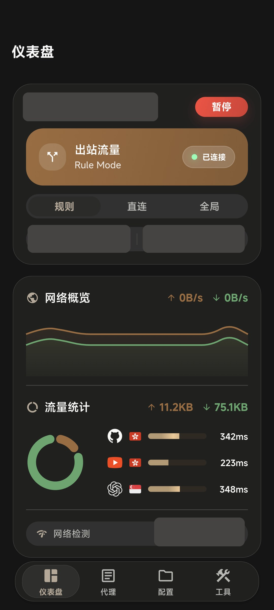
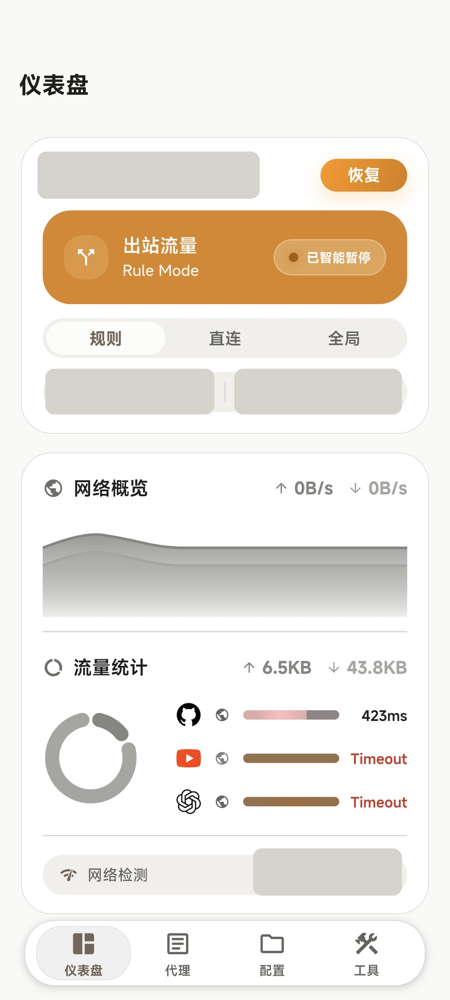
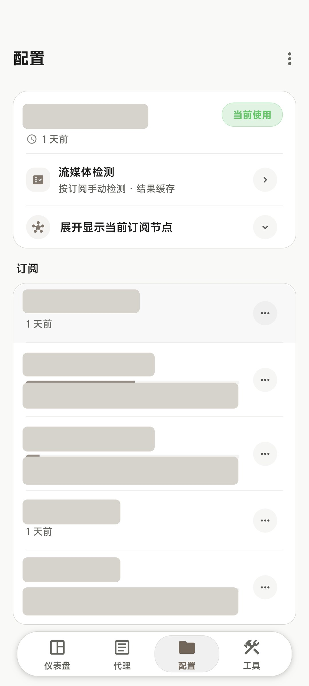

  <a href="README.md">简体中文</a> · <strong>English</strong>

# SlClash

SlClash is an Android proxy client built by continuously trimming, restructuring, and redesigning [FlClash](https://github.com/chen08209/FlClash) around the [Mihomo](https://github.com/MetaCubeX/mihomo) core.

It supports Android only and ships exclusively for `arm64-v8a`. The goal is not another shell that merely manages to launch Mihomo. We want a mobile client we are willing to depend on for years—one that keeps questioning its details and treats performance, power use, and interaction quality as product work.

## Our mission around Mihomo

SlClash exists to carry Mihomo's full semantics reliably onto Android, not to invent a private, simplified proxy language above the core.

Mihomo configurations, providers, proxy groups, rules, and runtime state are both the source of capability and the source of truth. If a configuration runs on the current bare Mihomo core, SlClash's goal is to accept it without rewriting its meaning and to bring its provider nodes, groups, and rules into the same runtime path. When Mihomo introduces or changes fields, protocols, or runtime capabilities, we follow after validating their Android lifecycle and compatibility implications instead of creating an incompatible substitute.

That mission also defines the project's boundaries:

- Mihomo owns proxy execution, the rule engine, and configuration semantics. SlClash owns their reliable Android integration, mobile interaction, lifecycle, performance, subscription workflows, and observability.
- Faithfully carrying Mihomo semantics is the long-term direction. We will keep expanding coverage, but we will not replace verification and maintenance with a claim that every future feature is automatically supported in full on day one.
- The project supports only Android and `arm64-v8a`. It will not rebuild desktop platforms, tray integration, desktop hotkeys, desktop system proxy, or distribution packaging. Real cross-platform needs are addressed through data portability with mature desktop clients.
- The Unified Subscription Center organizes, migrates, and restores subscriptions. It neither changes nor replaces Mihomo's core semantics.

## Maintenance and feedback

SlClash is actively maintained. Reports from real devices—especially stability, compatibility, and everyday usability issues—are the feedback we value most.

Please use [GitHub Issues](https://github.com/songzhengpei/Slclash/issues) or email [nudymanu@gmail.com](mailto:nudymanu@gmail.com). Clear defects, compatibility problems, and rough edges will continue to be fixed. Feature requests are evaluated case by case against Mihomo semantic consistency, the Android-only scope, long-term maintenance cost, and actual need.

## Why we keep maintaining this client

Android already has many Mihomo-based clients, but a crowded field does not automatically produce a carefully crafted one. We still want a client we can depend on and enjoy opening every day: proxy changes should converge reliably, startup should feel responsive, background work should remain restrained, memory and battery use should stay reasonable, and the interface should age well.

SlClash therefore does not measure progress by feature count. Performance, battery efficiency, and memory discipline are features themselves. An unnecessary refresh, an unbounded background task, or stale state after a network transition is a product issue—not optional cleanup for a later release.

We also treat visual design as engineering. A professional tool can preserve the information density its users need while offering clear hierarchy, restrained materials, and comfortable touch paths. SlClash aims for an interface that stands up to time without becoming frozen in it—one that evolves with the product instead of settling for an engineering panel that merely works.

## Interface

These screenshots come from a production Android build running on a real device. IP addresses, subscriptions, nodes, providers, accounts, and device-related details have been irreversibly redacted with solid masks.

  
  
  

  
  
  

  
  
  

  
  
  

## Unified Subscription Center: turn short-lived endpoints into durable subscription assets

Real subscriptions are not always URLs that remain valid for years. Ephemeral or one-time links, several commercial subscription services, self-hosted nodes, external providers, and endpoints that frequently change or expire often coexist. Once those sources are scattered across phones, desktops, and separate backups, organizing, migrating, and recovering them becomes increasingly expensive.

[Mihomo Subscription Vault](https://github.com/songzhengpei/mihomo-subscription-vault) is the private subscription snapshot center built for that problem. It is already available under the MIT license and deploys on Cloudflare Workers + R2. It normalizes upstream sources with different formats and lifetimes behind stable provider URLs, while retaining immutable versions, history rollback, and complete backup exports. Clients keep one durable endpoint instead of repeatedly chasing short-lived upstream links.

The same provider URL can be consumed by SlClash, Clash Verge Rev, OpenClash, and other Mihomo clients. Archives exported by the center can also be imported directly through SlClash's restore flow. Combined with Clash Verge Rev backup compatibility, this forms a clear migration and backup path among SlClash, Clash Verge Rev, and the Unified Subscription Center.

The center is intended for private deployment: subscription URLs, access tokens, and node assets remain in the user's own Cloudflare environment. Its source and implementation are public today and can be self-deployed; future work will continue to improve format coverage, restore behavior, and cross-client workflows.

## Why Clash Verge Rev backup compatibility matters

[Clash Verge Rev](https://github.com/clash-verge-rev/clash-verge-rev) is already an accomplished desktop client with strong interface design, functionality, compatibility, and resource management. SlClash does not need to duplicate that work across complex desktop environments, but phones and desktops should not require two isolated copies of the same subscriptions.

SlClash can therefore import Clash Verge Rev subscription backups, and a subscription package exported by SlClash can be imported back into Clash Verge Rev, enabling two-way migration between phone and desktop.

WebDAV backups follow Clash Verge Rev's existing `/clash-verge-rev-backup` directory convention so cross-client backups share one explicit location instead of creating another isolated directory. Subscription restores update only the relevant profile data while preserving SlClash settings, scripts, rules, and custom proxy groups.

## Redesigned for phones, not merely recolored

FlClash provides a strong cross-platform and Material You foundation. SlClash chooses to concentrate its design work on one form factor: Android phones. It preserves the information density a proxy client needs while reorganizing frequent paths—start, pause, resume, mode changes, subscription selection, proxy-group selection, and traffic observation—so common actions sit closer to the thumb and state changes are easier to confirm.

The interface shares one system of corner radii, spacing, type scales, semantic state colors, and modular cards. The dashboard, proxies, profiles, tools, bottom navigation, sheets, and dialogs are not a collection of unrelated screens; they use the same visual and interaction language. Important states are visible without becoming noisy, secondary information remains available without competing for attention, and touch targets and page rhythm keep evolving around one-handed use.

Light, dark, pure-black, dynamic, and custom themes are more than color inversion. Card hierarchy, borders, fills, state colors, charts, navigation, and system bars respond together. We will continue refining materials, information density, and modular presentation to build an interface that remains comfortable through daily use while still feeling renewed as the product evolves.

## Performance, battery, and memory are features

The performance work in SlClash is not a vague claim of being “lightweight.” Platform scope, refresh scheduling, cache bounds, rebuild scope, network transitions, and the VPN lifecycle have each been tightened deliberately:

- **Platform pruning:** Only Android and `arm64-v8a` remain. Desktop platforms, tray integration, desktop hotkeys and system proxy, Rust IPC, and distribution packaging paths have been removed, reducing build surface and runtime complexity.
- **Page- and lifecycle-aware scheduling:** Dashboard traffic probes run only while the service is active, the page is visible, and the app is in the foreground. Logs and requests use push delivery with batched presentation; high-frequency data uses bounded caches, throttling, and debouncing instead of driving continuous global UI rebuilds.
- **A quieter idle startup:** When the service is stopped, a cold UI launch no longer starts the remote core process in advance. On one device used for the Phase 4 baseline, this path avoided roughly 45 MB of remote-process PSS. It is reported as a device-specific measurement, not a promise that every device will produce the same number.
- **Controlled rebuild scope:** High-frequency runtime state is isolated to components that consume it, and no-op periodic refreshes have been removed. Real `FrameTiming` data is used for UI audits, and off-screen pages are not kept alive indiscriminately just to manufacture a faster-looking transition at the cost of memory and state lifetime.
- **Immediate, stable proxy selection:** Selection receives immediate visual feedback, rapid changes are debounced per group, and separate groups do not block one another. Runtime provider data, ownership guards, and snapshot freshness prevent stale results from overwriting the latest choice.
- **Less wasted VPN lifecycle work:** Native Android state is authoritative. Reattachment while running preserves the remote process, session, and TUN rather than launching duplicates. Smart Pause removes TUN while retaining the session and core, so leaving a trusted network does not require a full cold start.
- **Explicit boundaries for transitions and checks:** Network changes update local state, clear stale connections, and suppress bursts of duplicate work. Health checks use bounded concurrency, cached results, and cooldowns instead of repeatedly testing nodes that are failing or already cooling down.

A real-device Phase 4 harness audits startup, memory, navigation, proxy groups, IPC, VPN lifecycle, and background behavior. See the [performance harness documentation](tools/perf/README.md). Compatibility reports, Phase 4 closeouts, and typography records are indexed in [docs/README.md](docs/README.md).

## Features shaped by real usage

### Smart Pause

The VPN can pause automatically on trusted home, office, or router networks identified by IP/CIDR and resume when the device leaves. Debouncing, repeated-action protection, and a session-level manual-resume override keep automatic state changes from fighting the user.

### Independent media and health checks

GPT, YouTube, and health checks are separate modes. Opening the page does not start a check, and running one mode does not trigger another. Results are cached per mode; health checks also reuse cached results and cool down nodes that repeatedly time out or respond slowly.

Candidates come from Mihomo's actual runtime leaf-proxy data, including nodes downloaded by providers, rather than only from a static configuration search.

### Subscriptions, proxies, and resources

The proxy page supports group expansion, node selection, and latency checks for one node or an entire group. The profile page surfaces subscription state and direct management actions. The resource page manages GEOIP, GEOSITE, MMDB, ASN, and update schedules. Network Overview brings together live rates, traffic trends, common-site latency, and route-region hints so runtime behavior can be observed and judged.

More capabilities are in development, but every addition must first answer two questions: does it preserve Mihomo's original semantics, and does it materially improve long-term Android use?

## Download

Production and beta packages are available from [GitHub Releases](https://github.com/songzhengpei/Slclash/releases).

Only Android `arm64-v8a` is supported. Before building locally, read [`AGENTS.md`](AGENTS.md); personal SDK paths are intentionally kept out of this README.

## Acknowledgements

SlClash is built on [FlClash](https://github.com/chen08209/FlClash)'s cross-platform, Material You foundation and the [Mihomo](https://github.com/MetaCubeX/mihomo) / Clash.Meta ecosystem.

Thank you to the original authors and communities for the core, the client foundation, and the open technical discussions. FlClash serves multiple platforms; SlClash chooses to go deeper on Android and `arm64-v8a`. That is not a rejection of the original project, but a different tradeoff for a different long-term workflow.
