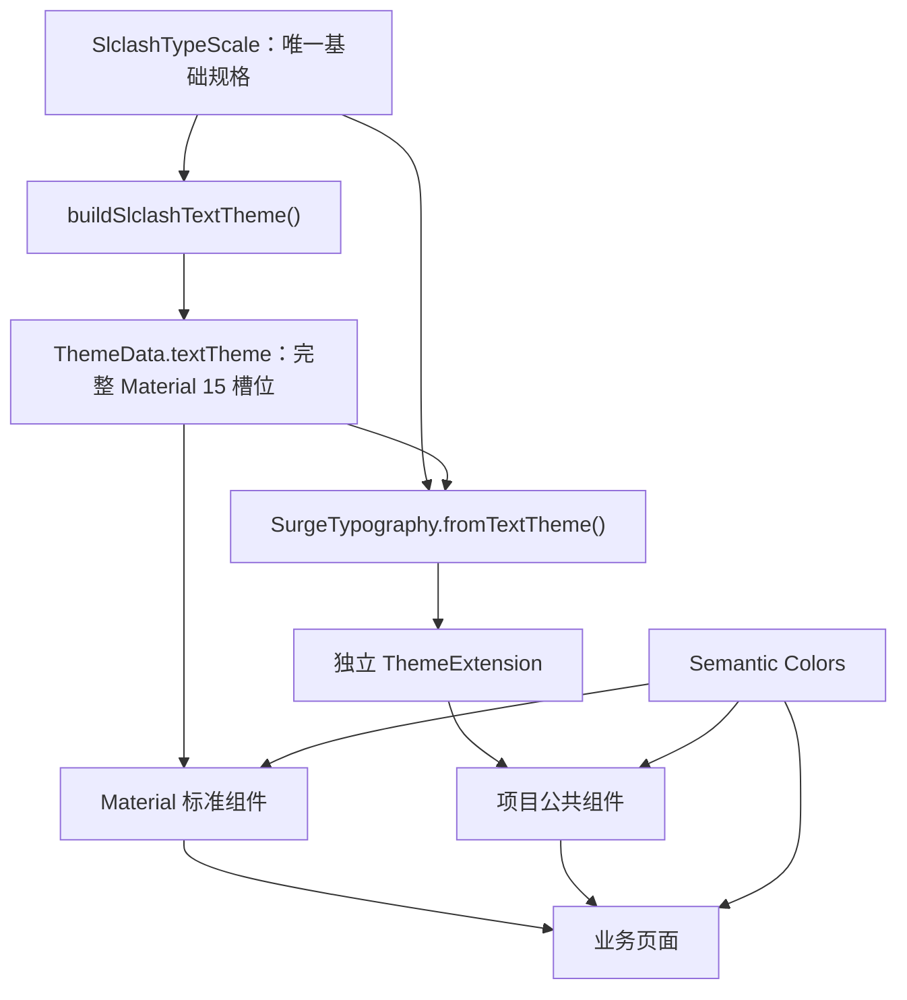

# Slclash 字体系统设计规范（第二阶段冻结稿）

> 版本：1.0
> 日期：2026-07-19
> 状态：已落地。本文件是当时的实施冻结稿；迁移结果见 `docs/design/typography-migration-report.md`。文中“本阶段不修改 Dart”只描述冻结当时的范围，不代表当前代码仍未迁移。
> 范围：Android、简体中文与英文
> 前置文档：`docs/design/typography-audit.md`

## 1. 执行摘要

本规范把现有五个字体事实来源收敛为一个基础规格源，并冻结 15 个项目语义角色、完整 Material `TextTheme` 映射、颜色职责、字体缩放行为、特殊白名单和迁移顺序。

最终数据流为：基础规格先构建无颜色的 Material `TextTheme`；独立的 `SurgeTypography` 只从该 `TextTheme` 和同一基础规格受控派生；公共组件只消费二者；业务页面只选择语义角色。页面不再创建字号、字重、行高、字距或字体族。

普通 UI 仅使用 Android 系统无衬线字体栈，最低 11sp，默认字重仅 w400/w500/w600。10sp 仅保留给严格白名单的 `chartLabel`；8sp、9sp、w700、w800 和 `FontWeight.bold` 不属于最终体系。JetBrains Mono 保留给 `technical`，Twemoji 作为字形回退例外。

系统字体缩放必须真实支持 100%、130% 和 200%。字体放大通过增高、换行、重排、滚动和 Wrap 解决，不再通过 clamp、`noScaling`、文字 `FittedBox`、`.ap/.mAp` 或英文缩小解决。

本阶段仅冻结规范，不修改 Dart、ThemeData、ARB、布局或界面行为。

## 2. 已接受的审计结论

第一阶段结论全部接受，不重新统计：

- 当前没有真正统一的字体系统，存在 Material 默认 TextTheme、现有 SurgeTypography、页面硬编码、字体扩展和 Dashboard 响应式字号五个事实来源。
- 扫描到 183 处 `fontSize:`，其中 150 处是直接数字；重字重 w700/w800/bold 共 63 处。
- 超过 40 处文字使用 `height: 1`，最小字号为 8sp。
- Profiles、Media Check、Dashboard 是主要混乱区；Media Check 字体最重，Profiles 字号最碎。
- 英文布局与 200% 系统缩放存在系统风险。
- SurgeTypography 具备语义化和 ThemeExtension 迁移价值，但颜色耦合、角色页面化且不与 TextTheme 共源，不能原样扩展。
- JetBrains Mono、Twemoji 当前用途基本合理；普通 UI 不需要额外中文字体或 Google Fonts。

仓库现状与审计报告一致：`ThemeData` 仍未显式设置统一 `textTheme`；`SurgeTypography` 仍是 `SurgeTheme` 的附属字段；Dashboard 仍以 `type/legacyType` 连续计算字号并把缩放封顶到 1.15。本阶段不修复这些差异。

## 3. 设计原则

1. **一个数值源**：字体值只在基础规格定义一次。
2. **语义优先**：调用者选择文字用途，不选择视觉数字。
3. **Material 完整**：15 个 TextTheme 槽位全部明确，标准组件不得回落到 Flutter 默认排版。
4. **排版与颜色分离**：Typography 不携带任何语义颜色。
5. **系统缩放优先**：布局适配文字，文字不牺牲缩放来适配布局。
6. **中英文同角色**：语言变化只影响内容和布局，不改变字体规格。
7. **字重克制**：结构依靠字号、颜色、空间、背景和位置，不能依赖粗体堆叠。
8. **少量离散档位**：不允许页面连续缩放或产生 10.5/13.5/14.5/15.5 等碎片值。
9. **特殊用途显式**：技术数据、图表小字和 emoji 必须通过白名单入口。
10. **兼容可撤销**：迁移门面只服务过渡，必须有删除条件。

## 4. 唯一数据源架构

建议的职责和文件边界（第三阶段再实施）：

- `lib/theme/typography/type_scale.dart`：基础常量与无颜色 `TextStyle` 规格；唯一可出现固定字体数值的业务基础设施文件。
- `lib/theme/typography/text_theme.dart`：构建完整 Material `TextTheme`。
- `lib/theme/typography/surge_typography.dart`：独立 `ThemeExtension<SurgeTypography>`，从 TextTheme/基础规格派生。
- `lib/theme/typography/typography_context.dart`：`context.typography` 稳定访问入口。
- `lib/theme/typography/font_families.dart`：系统字体、JetBrains Mono 与 Twemoji 白名单标识。
- `lib/application.dart`：只负责把已构建的 TextTheme 和 ThemeExtension 注入 ThemeData，不拥有字体数值。

依赖方向只能向下；`SurgeTheme`、Dashboard 或页面不得被基础 Typography 反向引用。

## 5. 基础字体规格

### 5.1 项目语义规格

Flutter `height` = 目标逻辑行高 ÷ 字号。实现时使用表中精确倍率；视觉验收按目标逻辑行高验收。

| 角色 | 字号 | 行高 | `height` | 字重 | 字体族 | 主要用途 |
|---|---:|---:|---:|---:|---|---|
| `screenTitle` | 22 | 28 | 1.2727 | w600 | system | 一级页面大标题 |
| `appBarTitle` | 20 | 26 | 1.3000 | w600 | system | AppBar、二级页面标题 |
| `dialogTitle` | 18 | 24 | 1.3333 | w600 | system | Dialog、BottomSheet 主标题 |
| `sectionTitle` | 15 | 22 | 1.4667 | w600 | system | 页面分区标题 |
| `cardTitle` | 16 | 22 | 1.3750 | w500 | system | 卡片主要标题 |
| `rowTitle` | 15 | 22 | 1.4667 | w500 | system | 设置项、列表项主标题 |
| `body` | 15 | 22 | 1.4667 | w400 | system | 正文、输入内容 |
| `supporting` | 13 | 18 | 1.3846 | w400 | system | 副标题、说明、辅助信息 |
| `controlLabel` | 14 | 20 | 1.4286 | w500 | system | 按钮、Tab、Chip、控件 |
| `navigationLabel` | 11 | 16 | 1.4545 | w500 | system | 底部导航 |
| `badgeLabel` | 11 | 16 | 1.4545 | w600 | system | Badge、短状态标签 |
| `metricLarge` | 24 | 30 | 1.2500 | w600 | system | 核心数据、主要指标 |
| `metric` | 16 | 22 | 1.3750 | w600 | system | 延迟、流量、状态数值 |
| `technical` | 13 | 18 | 1.3846 | w500 | JetBrains Mono | IP、端口、规则、日志、代码 |
| `chartLabel` | 10 | 14 | 1.4000 | w500 | JetBrains Mono | 图表刻度、极窄非主要技术标记 |

最终项目语义角色数量固定为 **15**。本轮不增加 `micro`、`heroTitle`、`loading` 或页面专属角色。

### 5.2 全局属性

- 普通 UI `fontFamily` 不显式设置，使用 Android 系统无衬线字体栈。
- `technical`/`chartLabel` 显式使用 `JetBrainsMono`；仅 Regular 字体文件存在时 Flutter 用合成字重呈现 w500，第三阶段应先验证实际 Android 渲染。若合成效果不合格，可在不改变角色规格的前提下补充 JetBrains Mono Medium 字体文件，此事项需单独审批。
- `letterSpacing` 统一为 0。允许在基础规格显式设置一次；业务和组件不得重复声明。
- `fontFeatures` 默认空。等宽数字若未来需要 `tabularFigures`，只能在基础规格增加受控的 `metric` 变体，不得页面自建。
- 不设置颜色、背景、装饰线、阴影或 locale 专属字体。
- 8sp、9sp 禁止；10sp 仅 chartLabel；普通用户必须阅读的信息最低 11sp。

## 6. 完整 Material TextTheme 映射

所有 15 个槽位均使用 system family、letterSpacing 0、无颜色。Display 不做营销型超大字号，只为第三方/Material 组件回落提供有限且确定的层级。

| Material role | 字号/行高 | `height` | 字重 | 来源/项目关系 |
|---|---:|---:|---:|---|
| `displayLarge` | 32/40 | 1.2500 | w600 | 基础受控槽位，仅特殊大数字/空状态；非公开常用角色 |
| `displayMedium` | 28/36 | 1.2857 | w600 | 基础受控槽位；非公开常用角色 |
| `displaySmall` | 24/30 | 1.2500 | w600 | 与 `metricLarge` 同规格复用 |
| `headlineLarge` | 24/30 | 1.2500 | w600 | 与 `metricLarge` 同规格复用 |
| `headlineMedium` | 22/28 | 1.2727 | w600 | 与 `screenTitle` 同规格复用 |
| `headlineSmall` | 22/28 | 1.2727 | w600 | `screenTitle` 直接引用 |
| `titleLarge` | 20/26 | 1.3000 | w600 | `appBarTitle` 直接引用 |
| `titleMedium` | 16/22 | 1.3750 | w500 | `cardTitle` 直接引用 |
| `titleSmall` | 15/22 | 1.4667 | w500 | `rowTitle` 直接引用 |
| `bodyLarge` | 15/22 | 1.4667 | w400 | `body` 直接引用 |
| `bodyMedium` | 13/18 | 1.3846 | w400 | `supporting` 直接引用 |
| `bodySmall` | 11/16 | 1.4545 | w400 | 小型辅助 Material 文本；普通 UI 最小槽位 |
| `labelLarge` | 14/20 | 1.4286 | w500 | `controlLabel` 直接引用 |
| `labelMedium` | 11/16 | 1.4545 | w500 | `navigationLabel` 直接引用 |
| `labelSmall` | 11/16 | 1.4545 | w500 | Material 小标签；不得替代 chartLabel |

允许多个 Material 槽位或项目角色复用同一基础规格；复用表示视觉规格相同，不表示语义可以互换。

## 7. 自定义语义 Typography 角色

### 7.1 直接引用 TextTheme

- `screenTitle` → `textTheme.headlineSmall`
- `appBarTitle` → `textTheme.titleLarge`
- `cardTitle` → `textTheme.titleMedium`
- `rowTitle` → `textTheme.titleSmall`
- `body` → `textTheme.bodyLarge`
- `supporting` → `textTheme.bodyMedium`
- `controlLabel` → `textTheme.labelLarge`
- `navigationLabel` → `textTheme.labelMedium`
- `metricLarge` → `textTheme.headlineLarge`

### 7.2 从共同基础规格受控派生

- `dialogTitle`：18/24 w600，Material 无完全对应槽位。
- `sectionTitle`：15/22 w600，与 row/body 同字号但语义字重不同。
- `badgeLabel`：11/16 w600，比 navigationLabel 强一档，禁止用作普通辅助文字。
- `metric`：16/22 w600，与 cardTitle 同字号但字重和用途不同。
- `technical`：13/18 w500 + JetBrains Mono。
- `chartLabel`：10/14 w500 + JetBrains Mono，严格白名单。

派生只能在 `SurgeTypography.fromTextTheme(...)` 或基础构建器内发生，不能由组件 `copyWith` 生成。

## 8. 字号、字重、行高和字体族规则

- 默认字重集合仅 w400、w500、w600。
- w700、w800、w900、`FontWeight.bold` 不保留为角色，也不得出现在普通业务/组件代码。
- 选中状态保持相同字重；用 semantic color、背景、indicator、图标、边框或位置表达。
- 行高必须来自角色；禁止 `height: 1` 和页面自定义行高。
- 英文与中文使用完全相同的 role、font family、size、weight、height 和 letterSpacing。
- 组件因空间不足不得切换更小角色，除非本规范明确允许 Dashboard 的离散角色切换。
- 字号不会随视口连续乘系数；系统 TextScaler 是唯一连续字体缩放来源。

## 9. Typography 与 Semantic Color 分工

| 属性 | Typography | Semantic Color | 业务状态层 |
|---|---|---|---|
| font family/size/weight/height/spacing/features | 唯一负责 | 禁止 | 禁止覆盖 |
| primary/secondary/disabled text | 不设置 | 负责 | 选择对应 token |
| selected/unselected | 不改变字重 | 提供颜色/背景/边框 | 选择状态 token |
| error/warning/success/connected | 不创建专用粗体 | 提供状态色 | `copyWith(color:)` 或组件参数受控应用 |
| 链接/强调 | 保持语义 role | 提供 accent/link | 可受控改颜色/decoration |

允许 `style.copyWith(color: semanticColor)`，条件是基础 style 已来自 TextTheme/SurgeTypography，且颜色来自 Theme/semantic token。禁止同时修改任何字体结构字段。建议公共组件优先接收 `foregroundColor`/状态枚举，由组件内部应用颜色，减少页面 copyWith。

## 10. SurgeTypography 重构方案

最终定位：**无颜色、独立、全局的 `ThemeExtension<SurgeTypography>`**。

目标特性：

- 与 `SurgeTheme` 平级注入 `ThemeData.extensions`，不持有或引用 SurgeColors。
- 构造入口只接受已完成的 `TextTheme`/基础规格。
- 15 个 final `TextStyle` 字段与本规范一一对应。
- 实现 `copyWith`（若 ThemeExtension 契约需要）和 `lerp`；插值只涉及排版值。
- 稳定入口为 `context.typography` 或 `Theme.of(context).extension<SurgeTypography>()!`。
- `SurgeTextStyles` 仅作为 deprecated 兼容门面。

兼容分两步：

1. 第三阶段先创建独立 extension，同时让旧 `SurgeTheme.typography` 返回同一个实例或代理到 `context.typography`；不得继续由颜色构造 Typography。
2. 公共组件和页面迁移完毕后删除 `SurgeTheme.typography` 字段、颜色参数 factory 及 `SurgeTextStyles`。

兼容入口最多保留到所有业务页面迁移完成后的一个清理提交，不跨越静态检查全面启用节点。

## 11. 现有角色迁移表

| 旧角色/接口 | 处理 | 新角色/路径 | 说明 |
|---|---|---|---|
| `title` | 拆分/废弃 | screenTitle/cardTitle/rowTitle | 旧 17/w600 语义含混，按实际用途选择 |
| `body` | 直接保留语义 | `body` / TextTheme.bodyLarge | 去颜色，15/22 w400 |
| `caption` | 更名 | `supporting` / bodyMedium | 13/18 w400 |
| `sectionTitle` | 直接保留 | `sectionTitle` | 调整到 15/22 w600，去颜色 |
| `appBarTitle` | 直接保留 | `appBarTitle` / titleLarge | w700 → w600 |
| `heroTitle` | 拆分/废弃 | screenTitle 或 metricLarge | 按文案标题/数据指标区分，不保留 hero 页面角色 |
| `cardTitle` | 直接保留 | `cardTitle` / titleMedium | 17/w700 → 16/22 w500 |
| `rowTitle` | 直接保留 | `rowTitle` / titleSmall | 16/default → 15/22 w500 |
| `rowSubtitle` | 更名 | `supporting` | 13/18 w400 |
| `fieldInput` | 合并/转 Material | `body` / bodyLarge | 输入值不设颜色 |
| `fieldHint` | 合并 | `body` + hint semantic color | 字体同输入，区别仅颜色 |
| `emptyState` | 拆分/废弃 | body 或 supporting | 标题另用 dialogTitle/cardTitle；颜色由 semantic color |
| `metric` | 拆分 | `metric` / `metricLarge` | 按核心程度离散选择 |
| `badge` | 更名 | `badgeLabel` | 12/w700/height1 → 11/16 w600 |
| `micro` | 废弃 | supporting/navigationLabel/badgeLabel | 按真实语义迁移，不允许通用微字 |
| `dashboardMicro` | 废弃 | chartLabel（仅白名单）或 supporting | 8sp 禁止；主要信息不得映射 chartLabel |
| `dashboardTiny` | 废弃 | chartLabel 或 navigationLabel | 10sp 仅图表技术标记 |
| `dashboardValue` | 合并 | metric 或 technical | 数据重要性与是否等宽决定 |
| `dashboardLabel` | 合并 | supporting/controlLabel | 不保留 Dashboard 专属角色 |
| `dashboardLoading` | 合并 | supporting | 加载说明必须可读，不用 10sp |
| `SurgeTextStyles.*` | deprecated 后删除 | `context.typography.*` | 兼容门面只保留迁移期 |

## 12. Dashboard 响应式字体方案

Dashboard 保留几何缩放、宽度断点、卡片重排和内容高度计算；删除连续字体缩放真值。

### 12.1 固定角色映射

| Dashboard 内容 | 默认角色 | 窄屏允许切换 | 备注 |
|---|---|---|---|
| Hero 页面/连接标题 | screenTitle | appBarTitle | 仅 `<360dp` 且结构重排后仍不足时离散切换 |
| 核心连接/流量数字 | metricLarge | metric | 只能离散切换，不乘比例 |
| 卡片标题 | cardTitle | 不切换 | 空间不足换行/增高 |
| 模式/策略控件 | controlLabel | 不切换 | 使用 Wrap/Column |
| 普通状态说明 | supporting | 不切换 chartLabel | 必须可读 |
| IP/延迟/速度/流量值 | technical 或 metric | technical | 技术数据可等宽 |
| 图表坐标/图例刻度 | chartLabel | chartLabel | 仅白名单位置 |
| 加载/错误说明 | supporting | 不切换 | 状态不是微型装饰 |

### 12.2 断点和缩放行为

- 宽度沿用现有 `<360` compact、`>600` wide 判断，可在实施时基于 320/360/384/412 验证调整布局断点，但不能调整字体值。
- 删除 `typographyScale`、`type(number)` 和 `legacyType(number)` 的字号职责。`geometryScale/legacy` 只能处理非文字几何。
- 删除 `maxTextScale = 1.15` 与 `textScalerForDashboard`；Dashboard 使用父级 MediaQuery TextScaler 原值。
- 130%：Hero 顶部 Row 可转两行/Column；模式与策略组 Wrap；卡片自然增高；图表区域与说明分离；页面保持滚动。
- 200%：Hero 控件纵向排列；核心指标可从 metricLarge 离散切换到 metric，但不得低于该角色；Network Overview 的图表、延迟和流量区按 section 纵向排列；卡片不设固定高度，必要时各区独立水平滚动技术数据，整页垂直滚动。

### 12.3 必须移除

- `dashboard.dart` 的页面级 TextScaler clamp。
- `network_overview_card.dart`、`traffic_usage.dart` 中用于缩小文字的 FittedBox。
- 所有 `layout.type(...)`、`legacyType(...)` 字号输入。
- Dashboard Typography 专属 roles 和 `copyWith(fontSize/height/weight)`。

没有普通文字技术例外。图表绘制空间若第三方 API 无法响应 TextScaler，只允许 `chartLabel` 作为明确例外，并必须提供可访问的同值文字摘要或语义标签。

## 13. 中英文布局规范

- 同一文案在中英文使用同一语义角色，不做 locale 字号分支。
- 本地化功能文案默认完整显示：先采用准确短术语，再使用 Flexible/Expanded、换行、增高、Wrap 或响应式重排。
- 页面标题、设置项名、功能名、按钮、Tab、系统状态和错误说明不得因英文变长而 ellipsis。
- Row 中包含本地化文本时，文本必须位于 Flexible/Expanded 或由明确可换行布局承载；trailing 不得挤压至不可读。
- 固定高度只能用于不含文字的装饰/图标区域；含文字组件只能设 `minHeight`，不得设阻止 200% 的最大高度。
- 英文术语在布局迁移阶段统一；建议冻结短术语：Dashboard、Proxies、Profiles、Tools、Resources、Media Check。最终措辞仍需产品/翻译审核。

### 导航与控件

- 底部导航：100% 与 130% 保持单行，使用确认过的短英文；导航项等分。200% 允许导航栏增高并显示两行，若 Material NavigationBar 无法稳定支持，则采用 icon + 两行 label 的自定义可访问布局，不能缩字或截断。
- Button：文字可换行、居中，使用最小高度；操作组空间不足改 Wrap/Column。主操作不可隐藏。
- Chip：单个 label 最多两行；Chip 组必须 Wrap。状态 Badge 保持短文案，长状态说明移到 supporting 文本。
- Tab：项目级固定少量 Tab 在 100% 可等分；英文或 130% 空间不足改 `isScrollable`；200% 使用横向滚动，不用 Wrap 改变顺序，也不 ellipsis。
- 设置项 trailing：100% 空间足够可同行；130% 当可用文本宽度不足 160dp 或系统 scale ≥1.3 时允许下移；200% 默认主标题、说明、trailing 纵向排列。

## 14. Ellipsis 使用规范

| 内容 | Ellipsis | maxLines 建议 | 处理优先级 |
|---|---|---:|---|
| Profile/节点/Provider 用户或外部名称 | 允许 | 1–2 | 保留完整值的 tooltip/details/accessibility label |
| 文件路径、URL、域名、UUID、规则表达式 | 允许 | 1–2 | technical；提供复制/详情 |
| 页面/AppBar 标题 | 禁止 | 2+ | 增高或换行 |
| 设置项/功能名称 | 禁止 | 2+ | trailing 下移 |
| Button/Tab/Chip 功能文案 | 禁止 | 1–2 | 增高、滚动或 Wrap |
| 系统状态/错误/空状态说明 | 禁止 | 不限制或合理上限 | 自然换行/滚动 |
| 图表刻度 | 受限允许 | 1 | 仅 chartLabel，需可访问摘要 |

任何允许 ellipsis 的外部数据必须有获取完整内容的途径，且语义树不得只暴露截断文本。

## 15. 100% / 130% / 200% 字体缩放规范

| 缩放 | 字体行为 | 布局行为 | 验收底线 |
|---:|---|---|---|
| 100% | 按 Token 原值 | 默认 Soft Utility OS 密度 | 无 8/9sp、无 height1、无非白名单截断 |
| 130% | TextScaler 完整生效 | 增高、局部换行、trailing 下移、操作组 Wrap | 无 RenderFlex overflow；所有操作可触达 |
| 200% | TextScaler 完整生效 | 默认允许多行/Column/滚动；密集卡片分区重排 | 不缩字、不裁切、不丢主要内容；焦点/点击目标正确 |

强制禁止：`TextScaler.noScaling`、页面级 clamp、旧 `textScaleFactor` 覆盖、文字 FittedBox、`.ap/.mAp`、为了固定高而减字号、英文专用小字号。

允许保留 FittedBox 的场景仅限不含文字的图形/图标；代码审查必须验证 child 树不含 Text/RichText/EditableText/Canvas 文字。

## 16. technical / chartLabel / Twemoji 白名单

| 白名单 | 允许 | 禁止 | 目录/审核要求 |
|---|---|---|---|
| `technical` | IP、端口、延迟、速度、流量、UUID、规则、配置、日志、编辑器、错误代码 | 标题、正文、导航、按钮、设置项名称 | 可用于全仓，但必须由 `context.typography.technical` 获取 |
| `chartLabel` | 图表坐标、图例、极窄刻度、非主要技术辅助标记 | 状态说明、Badge、按钮、导航、普通辅助、必须阅读的信息 | 仅 Dashboard/图表组件白名单；每处需审查 |
| Twemoji | emoji glyph/fallback、emoji-only 图形文本 | 普通文字、技术文本、标题/控件 | `widgets/text.dart` 和明确 emoji renderer；允许受控 `copyWith(fontFamily: Twemoji)` |

系统 monospace 使用点迁移到 `technical`，不再保留独立普通入口。Twemoji 不属于 15 个 Typography role，不参与普通字体静态规则。

## 17. 旧接口废弃和替代方案

| 当前接口 | 最终状态 | 替代路径 | 迁移期 |
|---|---|---|---|
| `toBold` | 废弃删除 | 选择 w500/w600 的语义角色 | 第三阶段标记 deprecated，页面迁移完删除 |
| `toSoftBold` | 废弃删除 | rowTitle/cardTitle/controlLabel | 同上 |
| `adjustSize` | 废弃删除 | 选择离散语义角色 | 同上 |
| `NumExt.ap/mAp` | 废弃删除 | 原生 TextScaler + 布局重排 | Dashboard/编辑器迁移后删除 |
| `toJetBrainsMono` | 废弃删除 | `typography.technical/chartLabel` | 技术场景迁移后删除 |
| `copyWith(fontSize/weight/height/spacing/family)` | 禁止 | 直接选择角色 | 静态检查先 warning 后 error |
| `copyWith(color:)` | 受控允许 | semantic color token | 长期允许 |
| 页面 `letterSpacing: 0` | 禁止新增并清除 | 基础规格统一定义 | 基础设施落地后检查 |
| Dashboard `type(number)` | 删除字号职责 | 固定 role + 布局断点 | Dashboard 专项迁移提交 |
| `TextScaler.noScaling` | 普通文字删除 | 原生 TextScaler | 高风险组件迁移时删除 |
| 文字 `FittedBox` | 删除 | 换行/增高/滚动/重排 | 高风险组件迁移时删除 |

临时豁免只允许：尚未迁移的明确文件清单、Typography 基础设施、Twemoji renderer、第三方适配和 Painter 图表。豁免必须逐文件带到期阶段，不允许以整个 `lib/views` 永久排除。

## 18. 页面 copyWith 允许与禁止矩阵

| 修改字段 | 页面 | 公共组件 | Typography 基础设施 | 特殊白名单 |
|---|---|---|---|---|
| `color` | 允许 semantic token | 允许 | 允许但基础 role 默认无色 | 允许 |
| `decoration` | 链接/错误定位受控允许 | 受控允许 | 可定义 | technical 链接可用 |
| `fontSize` | 禁止 | 禁止 | 允许构建 Token | 禁止；改选 role |
| `fontWeight` | 禁止 | 禁止 | 允许构建 Token | 禁止 |
| `height` | 禁止 | 禁止 | 允许构建 Token | 禁止 |
| `letterSpacing` | 禁止 | 禁止 | 允许统一设 0 | 禁止 |
| `fontFamily` | 禁止 | 禁止 | 允许 | 仅 Twemoji renderer 例外 |
| `fontFeatures` | 禁止 | 禁止 | 允许受控定义 | 需新增白名单审批 |

## 19. 高风险组件行为矩阵

| 组件 | 默认角色 | 英文策略 | 130% | 200% | Ellipsis | 固定高度 | 白名单 | 优先级 |
|---|---|---|---|---|---|---|---|---|
| AppBar | appBarTitle | 标题可两行，actions 保持可触达 | toolbar 增高 | 标题两行/三行，actions 可下移或菜单化 | 页面标题禁用 | 禁止最大固定高 | 否 | 高 |
| 底部导航 | navigationLabel | 短术语、常规单行 | 增高仍单行 | 允许两行并增高 | 禁止 | 仅 minHeight | 否 | 高 |
| 卡片标题 | cardTitle | Flexible、最多两行起 | 卡片增高 | 标题与 trailing 分行 | 外部名称才允许 | 禁止 | 否 | 高 |
| 设置项 | rowTitle + supporting | trailing 可下移 | 空间不足转两行结构 | 默认 Column，trailing 下一行 | 设置名称禁用 | 仅 minHeight | 否 | 高 |
| 列表项 | rowTitle + supporting | Flexible | 行高自然增长 | leading/title/trailing 可分区 | 外部名称允许 | 仅 minHeight | technical 可选 | 高 |
| Provider 行 | rowTitle + technical | 名称 1–2 行，完整详情可见 | trailing 延迟下移 | 名称/状态/操作纵向排列 | Provider 名允许 | 禁止 | technical | 高 |
| Profile 管理 Sheet | dialogTitle/rowTitle/controlLabel | 操作组 Wrap | Sheet 可滚动、行增高 | 全屏/大 Sheet，操作纵排 | Profile 名允许 | 禁止 | technical 仅路径 | 高 |
| Media Check | sectionTitle/metric/supporting/badgeLabel | 功能文案换行，筛选 Wrap | 固定卡高取消、结果行增高 | 分区纵排、整页滚动 | 节点/Profile 名允许 | 禁止 | technical/chartLabel 受限 | 最高 |
| Dashboard Hero | screenTitle/metricLarge/controlLabel | 控件 Wrap | Hero 增高、部分 Column | 全纵向；metricLarge 可离散到 metric | 外部值才允许 | 禁止 | technical | 高 |
| Network Overview Card | cardTitle/metric/technical/chartLabel | 标题/说明换行 | 图表与数值分区 | 各区纵排，技术区可横向滚动 | 外部技术数据允许 | 禁止 | technical/chartLabel/Twemoji | 高 |
| Resources 操作栏 | rowTitle/controlLabel/supporting | 操作 Wrap | 工具栏增高 | 操作纵排或菜单化 | 资源名允许 | 禁止 | technical 可选 | 高 |
| Tab | controlLabel | 空间不足横向滚动 | isScrollable | 横向滚动并增高 | 禁止 | 仅 minHeight | 否 | 中 |
| Chip | controlLabel | 组 Wrap，单项可两行 | 增高/Wrap | 纵向或 Wrap | 禁止功能文本 | 仅 minHeight | 否 | 中 |
| Badge | badgeLabel | 只承载短状态；长说明外置 | 增高 | 可换两行或改 supporting | 禁止状态说明截断 | 仅 minHeight | 否 | 中 |
| Dialog | dialogTitle/body/controlLabel | 标题正文完整 | action Wrap | 内容滚动、actions Column | 禁止 | 禁止 | technical 仅代码 | 高 |
| Logs | technical/supporting | 日志正文可横滚或换行按模式 | 行增高 | 日志区水平+垂直滚动，控制区重排 | 原始日志可视模式允许 | 禁止 | technical | 中 |
| Connection 行 | rowTitle/technical/supporting | 域名/地址外部数据可截断 | trailing 下移 | 分区纵排 | 外部域名/地址允许 | 禁止 | technical | 高 |
| 编辑器/代码文本 | technical | 不按语言缩字 | 编辑区双向滚动 | 双向滚动、工具栏重排 | 代码视图可裁切但可滚动 | 编辑 viewport 可固定可用区，不固定文本行高 | technical | 中 |

## 20. 分阶段代码实施顺序

每一步均可独立提交；只有通过本步验收才能进入下一步。

| 步骤 | 修改范围 | 前置依赖 | 验收 | 主要风险 | 截图/设备 |
|---:|---|---|---|---|---|
| 1 | 新建 type scale/font family 基础文件 | 本规范批准 | 单元测试精确值/无颜色 | 数值录入错误 | 不需要 |
| 2 | 构建完整 TextTheme，接入 `application.dart` | 1 | 15 槽位 golden/unit；analyze | Material 默认组件全局变化 | 需要基线截图 |
| 3 | 独立 SurgeTypography extension | 1–2 | 15 roles、lerp、无颜色测试 | ThemeExtension 访问空值 | 不需要设备，需测试 |
| 4 | 兼容访问入口 | 3 | 新旧入口返回同规格 | 双实例漂移 | 不需要 |
| 5 | AppBar、底部导航 | 2–4 | 中英 100/130/200，无截断 | 导航高度/系统 inset | Android 设备+截图 |
| 6 | 公共列表、设置、卡片、Dialog | 5 | widget tests + 高缩放 | 影响面广 | 截图 |
| 7 | Button、Tab、Chip、Badge | 6 | 状态不改变字重；英文完整 | 状态宽度变化 | 截图 |
| 8 | Dashboard | 5–7 | 移除 clamp/type/FittedBox；全矩阵 | 最大布局重构 | 必须设备+截图 |
| 9 | Profiles 主页面 | 6–7 | 管理 Sheet/预览通过矩阵 | 文件大、状态多 | 必须截图 |
| 10 | Media Check 专项 | 8–9 | 无 w800/9sp/固定高；测试保持独立模式 | 业务行为回归 | 必须设备+测试+截图 |
| 11 | Resources/Proxies/Logs/Connection | 6–7 | 外部数据 ellipsis 合规 | 密集列表性能 | 截图 |
| 12 | 编辑器、图表、Twemoji | 8、11 | 白名单逐处审查 | 第三方渲染限制 | 设备测试 |
| 13 | 英文布局与 ARB | 5–12 | 术语审核、中英矩阵 | 文案变化 | 必须截图 |
| 14 | 删除旧接口/兼容门面 | 全迁移完成 | rg 零调用、analyze/test | 隐式调用遗漏 | 不需要 |
| 15 | 静态检查 error 化 | 14 | CI 阻止新硬编码 | 误报 Painter/Twemoji | 不需要 |
| 16 | 全回归 | 15 | 320/360/384/412 × zh/en × 100/130/200 | 设备矩阵成本 | 必须设备+截图 |

第三阶段只执行步骤 1–4 的基础设施，不夹带业务迁移。建议首批修改文件：新建 `lib/theme/typography/*`，随后最小改动 `lib/application.dart`、`lib/widgets/surge/surge_tokens.dart`、`lib/widgets/surge/surge_theme_extension.dart` 以注入独立扩展和兼容入口。

## 21. 静态检查设计

静态检查在基础设施建立后先以报告/警告运行，所有迁移完成并删除旧接口后升级为 CI error。

禁止模式：

- 非白名单文件中的 `TextStyle(`、`fontSize:`、`fontWeight:`、文字 `height:`、`letterSpacing:`、`fontFamily:`。
- `FontWeight.bold/w700/w800/w900`。
- `copyWith` 修改 fontSize/fontWeight/height/letterSpacing/fontFamily/fontFeatures。
- `.toBold/.toSoftBold/.adjustSize/.ap/.mAp/.toJetBrainsMono`。
- `TextScaler.noScaling`、页面级 textScaler clamp、旧 textScaleFactor 覆盖。
- child 含文字的 `FittedBox`。
- Dashboard `type/legacyType` 用于字体。

永久白名单：

- `lib/theme/typography/**` 基础设施。
- Twemoji renderer 的受控 fontFamily 覆盖。
- 经登记的 Painter/第三方图表适配；仅能使用 chartLabel 规格。
- 测试中用于验证静态检查本身的 fixture。

临时白名单使用 manifest：文件路径、原因、负责人/阶段、删除步骤。每次迁移提交缩小 manifest；禁止目录级永久排除。检查应优先用 Dart analyzer/custom lint 理解 AST，避免正则把 SizedBox.height 误判成 TextStyle.height。

## 22. 测试矩阵

### 22.1 必测组合

| 维度 | 值 |
|---|---|
| 宽度 | 320、360、384、412dp |
| 语言 | zh_CN、en |
| 字体缩放 | 1.0、1.3、2.0 |
| 主题 | light、dark；动态色至少抽测一组 |
| Android | 最低支持 API 与当前主力 API 各一台/模拟器 |

基础组合 4 × 2 × 3 = 24 组；核心组件全部覆盖。主题/API 可在风险点分层抽测，AppBar、导航、Dashboard、Profiles、Media Check 必须 light/dark 都有截图。

### 22.2 自动测试

- 基础规格精确值测试：15 项目 roles + 15 Material slots。
- 所有 style 无颜色；普通 roles 为 system family；technical/chartLabel 为 JetBrains Mono。
- TextTheme/SurgeTypography 映射身份或值相等测试。
- ThemeExtension `lerp`、light/dark 同排版测试。
- 组件在 constrained width + text scale 下无 overflow 的 widget test。
- selected/unselected style 的 size/weight/height 完全相等。
- Media Check 现有独立模式测试保持通过。
- 静态检查 fixture 的允许/禁止用例。

### 22.3 人工/截图验收

- 不只看无 overflow，还要检查可读顺序、触控目标、焦点、滚动到达性和完整文案。
- 对允许 ellipsis 的外部数据确认可查看/复制全值以及 semantics 完整。
- 200% 验证没有文字被 FittedBox 缩回、裁切、遮挡或压在图标下。
- 对 JetBrains Mono w500 合成效果做真机视觉检查。

## 23. 风险与回滚策略

| 风险 | 控制 | 回滚单位 |
|---|---|---|
| TextTheme 接入导致 Material 组件全局变化 | 独立提交、基线截图、完整槽位测试 | 回滚 TextTheme 接入提交 |
| SurgeTheme 与独立 Typography 双实例漂移 | 单 factory、兼容代理、相等测试 | 保留旧读取门面，回滚注入 |
| 200% 重排引入业务交互回归 | 组件逐批迁移、现有测试、设备操作 | 按组件提交回滚，不回退 Token |
| Dashboard 改动过大 | 字体/布局同一个 Dashboard 专项分支但分小提交 | 回滚 Dashboard 迁移，保留基础设施 |
| 静态检查误报 | warning 观察期、AST 检查、白名单 manifest | 回滚 rule severity，不回滚迁移 |
| JetBrains Mono w500 合成不佳 | 真机验收，必要时补 Medium 资源 | 临时 technical 用 w400，需设计复核 |
| 英文术语变化引发布局/翻译争议 | ARB 独立阶段、术语表审核 | 回滚文案提交 |

不允许通过恢复 clamp、noScaling、文字 FittedBox、英文小字号或 w700/w800 作为回滚方案。若布局暂时无法适配，应回滚该组件迁移并保留在临时豁免清单。

## 24. 第三阶段开始前验收清单

- [ ] 人工批准 15 个最终角色及所有精确数值。
- [ ] 人工批准完整 Material TextTheme 映射。
- [ ] 确认普通 UI 最低 11sp，chartLabel 10sp 为唯一字号例外。
- [ ] 确认普通 UI 不保留 w700/w800/bold。
- [ ] 确认 SurgeTypography 独立于 SurgeTheme 和颜色。
- [ ] 确认颜色 copyWith 的受控范围。
- [ ] 确认 Dashboard 删除连续字号缩放及 1.15 clamp。
- [ ] 确认 100/130/200% 都完整尊重系统 TextScaler。
- [ ] 确认中英文同角色与 Ellipsis 白名单。
- [ ] 确认 technical/chartLabel/Twemoji 白名单。
- [ ] 确认旧接口 deprecation、兼容门面和删除时点。
- [ ] 确认第三阶段仅做基础设施步骤 1–4，不迁移业务页面。
- [ ] 确认静态检查先 warning、迁移完成后 error。
- [ ] 确认测试设备/模拟器能够覆盖 320/360/384/412dp 和 1.0/1.3/2.0。

审核通过前不得开始第三阶段。本文件批准后即成为后续字体实现、迁移、审查和回归测试的唯一设计依据；任何偏离均需更新本规范并再次人工确认。
